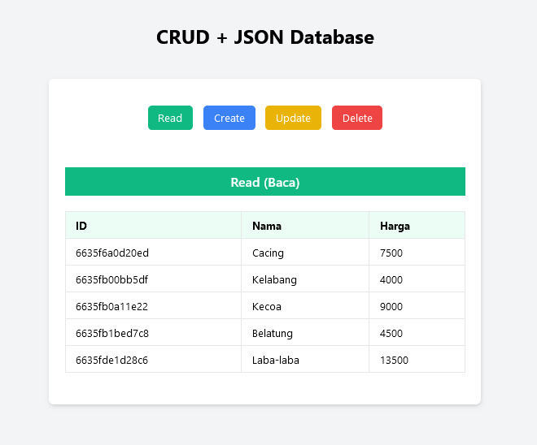

# Crud Data Json .PHTML
Proyek CRUD PHP+HTML (.phtml) sederhana yang menggunakan JSON sebagai databasenya & Tailwind CSS untuk mempercantik tampilannya.

Cocok untuk kamu yang ingin mempelajari operasi CRUD (Create, Read, Update, & Delete)



## Installation

- Jalankan server local. (xampp, sejenisnya.).
- Clone repositori di dalam folder htdocs (xampp).
```
git clone https://github.com/fitri-hy/crud-data-json-php.git
```
- Buka di browser.
```
http://localhost/crud-data-json-php/index.phtml
```


Support me by giving stars.
